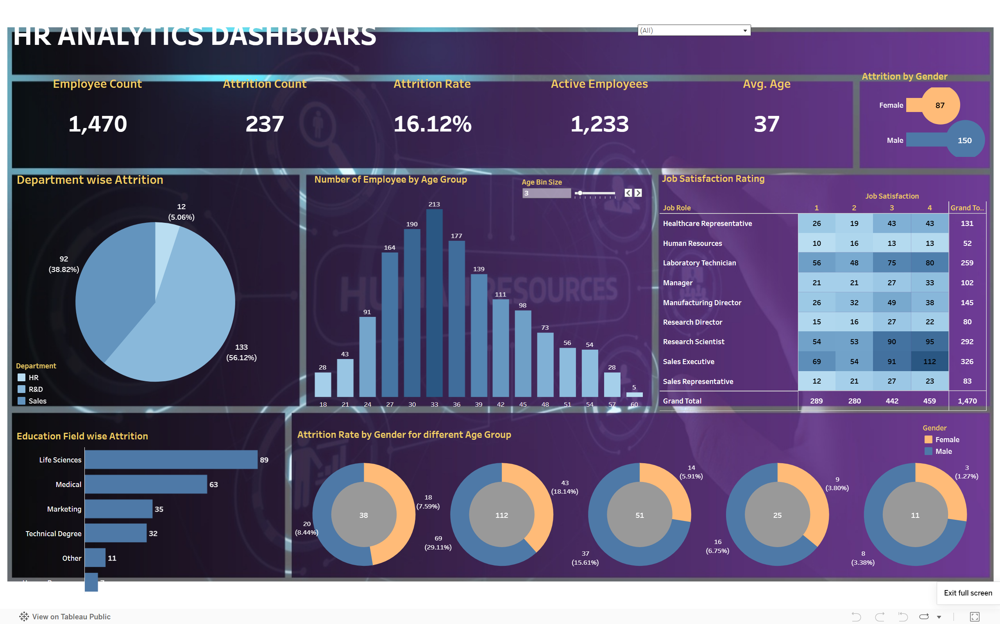

# HR 人力分析仪表盘 – 员工离职分析

## 🔗 互动仪表盘

[Live Dashboard](https://public.tableau.com/app/profile/jeremy.xio/viz/HRAnalysticsDashboard_17742343134410/HRANALYSTICSDASHBOARD)
*提示：为了最佳体验，请使用全屏模式查看。*

## ⚙️ 仪表盘使用说明

* 选择不同的 **教育水平** 比较离职模式。
* 调整 **年龄区间** 分析不同职业阶段的离职情况。
* 将鼠标悬停在图表上查看详细指标。
* 点击类别筛选数据，深入分析特定员工群体。

## 📌 项目目标

本项目旨在分析员工数据，识别驱动员工离职的关键因素。仪表盘帮助人力资源团队了解员工结构和行为模式，并基于数据做出决策以提高员工留存率。

## 📊 数据集

* 数据集：HR Analytics 数据集
* 包含特征：

  * 员工人口统计信息（年龄、性别、教育水平）
  * 工作相关因素（部门、岗位、薪资、加班情况）
  * 绩效及满意度指标
* 数据在可视化前已完成清洗和预处理。

## 🛠 使用工具

* Tableau（数据可视化与仪表盘设计）
* Excel / CSV（数据预处理）

## 📈 仪表盘概览

仪表盘提供互动视图，包括：

* 员工整体离职率
* 按部门、岗位及人口统计信息的离职情况
* 加班、收入及工作满意度等因素的影响
* 不同员工群体的关键趋势与对比

## ⚙️ 互动功能

* 可根据部门、岗位、教育水平及年龄区间动态筛选数据
* 图表间交互过滤，实现深度探索
* 悬停提示显示详细员工指标
* 可钻取到高风险群体进行分析
* 帮助人力资源团队识别模式并进行针对性干预

## 🔍 关键发现

* 加班员工的离职率明显较高
* 年轻员工的离职率高于资深员工
* 某些部门（如销售或高压岗位）离职率更高
* 低工作满意度与员工离职高度相关

## 💡 建议

* 减少过度加班以提升员工留存率
* 聚焦早期职业员工的参与度和支持
* 通过改善管理和工作环境提高工作满意度
* 将人力资源资源集中在高离职率部门

## 📸 仪表盘预览

## 🚀 未来改进

* 引入预测模型预测员工离职
* 增加更细化的分组（如入职年限、晋升历史）
* 连接实时数据源，实现仪表盘动态更新